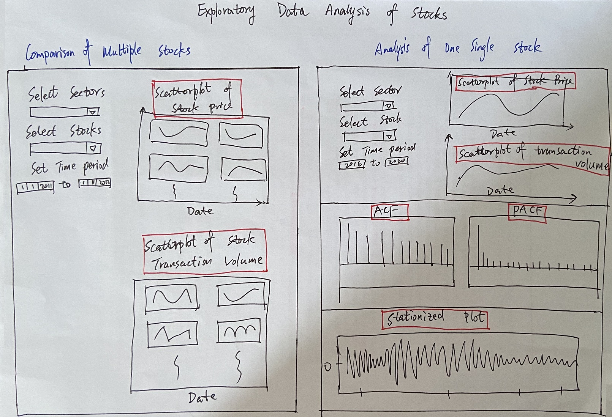

<!-- Set up the environment -->
```{r setup, include=FALSE}
knitr::opts_chunk$set(echo = TRUE)
```

# 1. Overview

This post is served as a sub-module of Visual Analytics project. I aim to leverage on the time series analysis techniques and interactivity approaches in R to present the possible visualizations of US Market stocks.

Throughout this exercise, I mainly use the <span style="color:red"> **"tidyverse", "tidyquant", "timetk", "TSstudio"** </span> and <span style="color:red"> **"forecast"** </span> packages in R to explore the patterns of the stock prices and the transaction volumes. Basically, it will consists of Single Time Series Analysis, Multiple Time Series Analysis and Auto-correlation Plots. The entire project will incorporate the Machine Learning and ARIMA Model Forecasting, thus this sub-module is the preliminary data exploration to interpret the data behaviors and patterns and the pre-processing step for further analysis.

# 2. Literature Review

According to APTECH, Time series data is data that is collected at different points in time. 

A few examples are shown as below. (Reference: [APTECH](https://www.aptech.com/blog/introduction-to-the-fundamentals-of-time-series-data-and-analysis) )


Generally speaking, the Time Series data has six basic patterns:

-   Trend: the overall direction of the change
-   Variability: the average degree of the change throughout a particular time span
-   Rate of Change: the percentage of the change from one point to another
-   Cycles: the patterns that repeat at regular intervals (such as daily or weekly etc.)
-   Exceptions: the values fall outside the norms
-   Co-variation: two time series relate to one another then the changes in one are reflected as changes in the other

Thus, visualizing time series data provides a preliminary tool for detecting if data:

+ Is mean-reverting or has explosive behavior;
+ Has a time trend;
+ Exhibits seasonality;
+ Demonstrates structural breaks.

In this project, we target on the US Market stocks as the Stock prices and transaction volumes are sort of time series data. In addition, we would try to do Forecasting on the Stock prices (in another sub-module).

In this sub-module, I will start off with visualizing some stocks' prices and transaction volumes as Exploratory Data Analysis.

Then, I will pick one stock and use Autocorrelation function (*ACF*) and Partial Autocorrelation function (*PACF*) to stationize it. Why do we need to stationize the data? Well, in general, the stock prices and volumes are not stationary data, Thus in order to do Forecasting afterwards, making it stationary is a must-have processing step.


# 3. Exploring and Visualizing the stock data


### Check the required R packages and load them
```{r echo = TRUE, message = FALSE, warning = FALSE}
packages = c('timetk', 'modeltime', 'tidymodels', 'lubridate', 'tidyverse', 'tidyquant', 'TSstudio', 'forecast')

for(p in packages){
  if(!require(p, character.only = T)){
    install.packages(p)
  }
  library(p, character.only = T)
}
```

### Load the data

We selected 8 stocks from 4 different sectors.  

+   Industrials sector: AAL (American Airlines), SAVE (Spirit Airlines)
+   Financials sector: BAC (Bank of America), JPM (JP Morgan)
+   Healthcare sector: JNJ (Johnson & Johnson), PFE (Pfizer)
+   Information Technology sector: MSFT (Microsoft), AAPL (Apple Inc.)

In this paper, we focus on the period from 2015 April 1 to 2021 March 31.

tq_get() function is used to retrieve the stock prices and transaction volume.

```{r}

stocks = c('AAL', 'SAVE', 'BAC', 'JPM', 'JNJ', 'PFE', 'MSFT', 'AAPL')

startdate <- "2015-04-01"
enddate <- "2021-03-31"

data <- data.frame()

for(s in stocks){
  newstock <- tq_get(s, get = "stock.prices", from = startdate, to  = enddate)
  data <- rbind(data, newstock)

}
```

<!-- rm(list=ls()) -->

### Scatterplot of 8 stocks' prices

Let's display them by 2 columns. 

```{r}
data %>%
  group_by(symbol) %>%
  plot_time_series(date, adjusted,
                   .color_var = year(date),  
                   .facet_ncol = 2,
                   .interactive = T,
                   .y_intercept = 0,
                   .title = "Stocks Price",
                   # .x_lab = "Date",
                   # .y_lab = "Price (US$)",
                   .color_lab = "Year",
                   .plotly_slider = FALSE) 

```


### Scatterplot of 8 stocks' transaction volumes

Let's display them by 2 columns. 

```{r}
data %>%
  group_by(symbol) %>%
  summarise_by_time(
    date, .by = "month",
    volume = SUM(volume)
  ) %>%
  plot_time_series(date, volume, 
                   .facet_vars   = contains("symbol"),
                   .title = "Transaction Volume",
                   .facet_ncol = 2, .interactive = T, .y_intercept = 0)
```


### Scatterplot of the stock price - Weekly Trend  

We can aggregate the data by weekly basis. Here, I choose American Airlines as an example.

```{r}
data %>%
  filter(symbol == "AAL") %>%
  summarise_by_time(
    date, .by = "week",
    meanadjusted = mean(adjusted)
    ) %>%
  plot_time_series(date, meanadjusted, .interactive = T, .y_intercept = 0)
```


### Scatterplot of the stock price - Monthly Trend  

We can aggregate the data by monthly basis. Here, I choose Spirit Airlines as an example.


```{r}
data %>%
  filter(symbol == "SAVE") %>%
  summarise_by_time(
    date, .by = "month",
    meanadjusted = mean(adjusted)
    ) %>%
  plot_time_series(date, meanadjusted, .interactive = T, .y_intercept = 0)
```


### Interactive scatterplot of the stock price   

Here, I choose Johnson & Johnson as an example.


```{r}
JNJ <- data %>%
  filter(symbol == "JNJ") %>%
  select("date", "adjusted")
  
ts_plot(JNJ,
        title = "Johnson and Johnson",
        Xtitle = "Date",
        Ytitle = "Price",
        color = "blue",
        slider = TRUE,
        Xgrid = TRUE,
        Ygrid = TRUE)
```


### Interactive scatterplot of the stock volume   

Here, I illustrate with Apple Inc. stock.


```{r}
apple <- data %>%
  filter(symbol == "AAPL") %>%
  select("date", "volume")
  
ts_plot(apple,
        title = "Apple Inc.",
        Xtitle = "Date",
        Ytitle = "Volume",
        color = "pink",
        slider = TRUE,
        Xgrid = TRUE,
        Ygrid = TRUE)
```

# 4. Stationize the data

Let's pick one stock *"JP Morgan"* from __Financials sector__ and illustrate how we can make the data stationary.


### Visualize the JP Morgan price  

```{r}
jpmorgan <- data %>%
  filter(symbol == "JPM")

jpmorgan %>%
plot_time_series(date, adjusted, .color_var = year(date), .interactive = T)
```

### Assesse its ACF and PACF  

In R this is done with the appropriately named acf and pacf functions.

+ Plot the ACF(Autocorrelation Function)

The ACF shows the correlation of a time series with lags of itself. That is, how much the time series is correlated with itself at one lag, at two lags, at three lags and so on.

```{r}
acf(jpmorgan$adjusted)
```

+ Plot the PACF(Partial Autocorrelation Function)

The PACF is a little more complicated. The autocorrelation at lag one can have lingering effects on the autocorrelation at lag two and onward. The partial autocorrelation is the amount of correlation between a time series and lags of itself that is not explained by a previous lag. So, the partial autocorrelation at lag two is the correlation between the time series and its second lag that is not explained by the first lag.

```{r}
pacf(jpmorgan$adjusted)
```

### Use the Differencing technique  

Differencing a time series method, to subtract each data point in the series from its successor. It is commonly used to make a time series stationary. Besides, if the time series appears to be seasonal, a better approach is to difference with respective season's data points to remove seasonal effect.


But, how should we know how many differencing is needed? the __nsdiffs__ and __ndiffs__ from *forecast* package can help find out how many seasonal differencing and regular differencing respectively is needed to make the series stationary. (**Note: For most time series patterns, 1 or 2 differencing is necessary to make it a stationary series.**)

##### Seasonal Differencing
```{r}
# nsdiffs(jpmprice$adjusted)  # number for seasonal differencing needed
#> Error in nsdiffs(jpmprice$adjusted) : Non seasonal data
```

##### Regular Differencing
```{r}
ndiffs(jpmorgan$adjusted)  # number of differences needed
```

##### Make it stationary
```{r}
stationaryTS <- diff(jpmorgan$adjusted, differences= 1)
plot(stationaryTS, type="l", main="Differenced and Stationary")  # appears to be stationary
```


# 5. Observations & Suggestions  


+ Different sector's performances are significantly different in the same period.

The airlines' stock prices dropped dramatically due to the Covid-19 in year 2020 whereas the stock prices of Healthcare sector and Information Technology sector skyrocketed because Covid-19 boosts the usage of healthcare products and IT products.

> From the 1st observation, I suggest that we need to show a few different stock sectors for the users to select when we build the final Shiny App.


+ In the same sector, by and large the stocks behave similarly in the long run. 

In other words, the stocks in the same sector show the same trends and fluctuations. For instance, if we compare the Apple Inc.'s price scatterplot with Microsoft Corporation one in the past 5 years, their performance are almost the same. If we check the American Airlines and Spirit Airlines's prices scatterplots, they look almost the same too. Probably the stocks in the same sector would be affected by the sector's outlook and investor's sentiments on the sector. If the investors favor one sector, most stocks in this sector would benefit. 

> From the 2nd observation, I suggest that we may also need to allow users to select several stocks from the same sector in the final Shiny App.

+ In early 2020, all the stocks' transaction volumes peaked in a historic record.

This could be explained by the Covid-19 factor too. Investors rushed to sell off the stocks negatively affected by Covid-19 and buy in the stocks positively affected by Covid-19 substantially.

> From the 3rd observation, we should display the stock's transaction volume data as well as price data in the final Shiny App as both can tell some meaningful insights.

+ The differencing technique can be used as pre-processing step to make the time series data stationary for further
modeling.

> From the 4th observation, we can present the stationized plots (ACF and PACF charts) along with a little explanations.

+ Other thoughts

> On top of the ideas above, as the key components of EDA, in my view, we can make the Start-date and End-date as calender view selections so that the users will be able to choose any time period as they wish. 

# 6. Storyboard for the design of the sub-module.

After examining and exploring the stock data, I propose the design of EDA layout as below.

1. We can have two tabs: one is to compare multiple stocks and the other one is to deep dive into one stock analysis.

2. In the comparison page of multiple stocks, both the price and transaction volume will be displayed.

3. In the one stock analysis page, the price, transaction volume, ACF & PACF and final stationary charts will be plotted.

The storyboard for the design is attached as below.



# 7. References

+ Wikipedia about Time Series: https://en.wikipedia.org/wiki/Time_series;
+ Github about the Timetk package: https://business-science.github.io/timetk/articles/TK04_Plotting_Time_Series.html;
+ Business Science: https://www.business-science.io/code-tools/2020/08/19/five-minute-time-series-rolling-calculations.html;
+ Tidyquant: https://cran.csiro.au/web/packages/tidyquant/vignettes/TQ02-quant-integrations-in-tidyquant.html;
+ Tidyquant package: https://cran.r-project.org/web/packages/tidyquant/index.html;
+ Time Series Analysis with R from R-Statistics: http://r-statistics.co/Time-Series-Analysis-With-R.html
+ Time Series with R from Dominodatalab: https://blog.dominodatalab.com/time-series-with-r/
+ Stocks sectors breakdown:
https://www.investopedia.com/terms/s/sector-breakdown.asp;
+ Stocks market: https://www.fool.com/investing/stock-market/market-sectors;