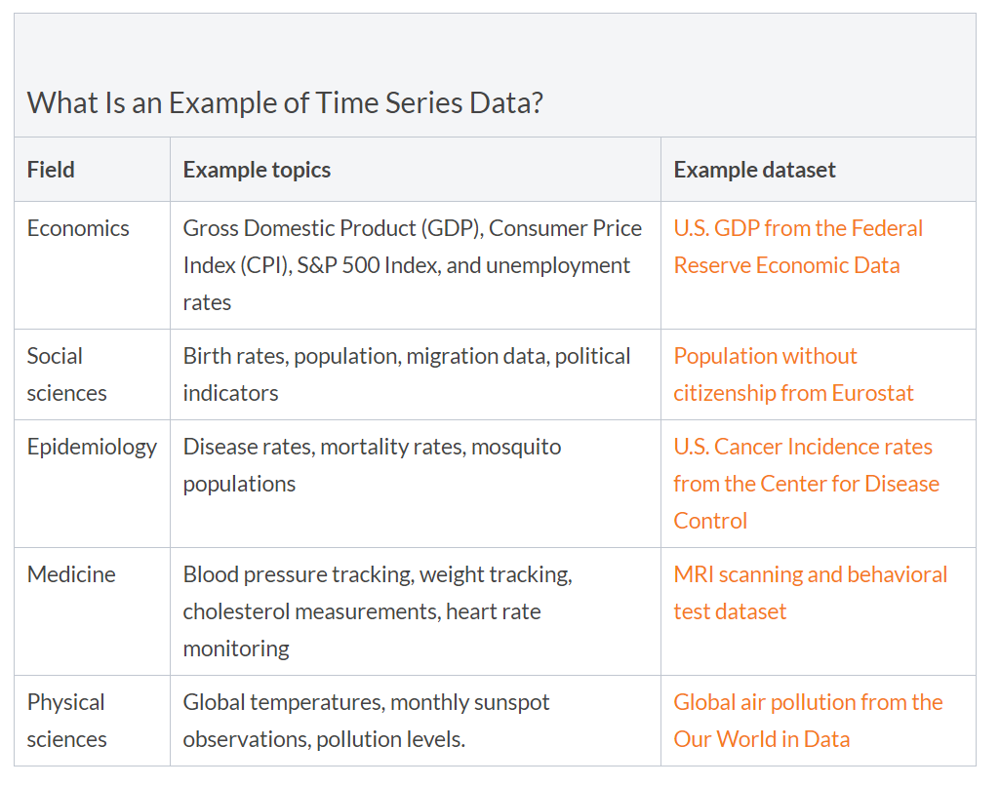

<!-- Set up the environment -->
```{r setup, include=FALSE}
knitr::opts_chunk$set(echo = TRUE)
```

# 1. Overview

This post is served as a sub-module of Visual Analytics project. I aim to leverage on the time series analysis techniques and interactivity approaches in R to present the possible visualizations of US Market stocks.

Throughout this exercise, I mainly use the <span style="color:red"> **"tidyverse", "tidyquant"** </span> and <span style="color:red"> **"timetk"** </span> packages in R to explore the patterns of the stock prices and the transaction volumes. Basically, it will consists of Single Time Series Analysis, Multiple Time Series Analysis, Seasonality and Auto-correlation Plots. As the entire project will incorporate the Machine Learning and ARIMA Model Forecasting, this sub-module is the preliminary data analysis step to interpret the data behaviors and patterns.

# 2. Literature Review and Suggestions

According to APTECH, Time series data is data that is collected at different points in time. 

A few examples are shown as below. (Reference: [APTECH](https://www.aptech.com/blog/introduction-to-the-fundamentals-of-time-series-data-and-analysis) )



Generally speaking, the Time Series data has six basic patterns:

-   Trend: the overall direction of the change
-   Variability: the average degree of the change throughout a particular time span
-   Rate of Change: the percentage of the change from one point to another
-   Cycles: the patterns that repeat at regular intervals (such as daily or weekly etc.)
-   Exceptions: the values fall outside the norms
-   Co-variation: two time series relate to one another then the changes in one are reflected as changes in the other

Thus, visualizing time series data provides a preliminary tool for detecting if data:

+ Is mean-reverting or has explosive behavior;
+ Has a time trend;
+ Exhibits seasonality;
+ Demonstrates structural breaks.

In this project, we target on the US Market stocks. Stock prices and transaction volumes are sort of time series data.

We will start off with visualizing the stock prices and transaction volumes. Then, we will focus on one or two stocks and use autocorrelation function and partial autocorrelation function to analyze.

ACF: Autocorrelation function

PACF: Partial Autocorrelation function

# 3. Exploring and Visualizing the data via available methods in R


### Check the required R packages and load them
```{r echo = TRUE, message = FALSE, warning = FALSE}
packages = c('timetk', 'modeltime', 'tidymodels', 'lubridate', 'tidyverse', 'tidyquant', 'TSstudio', 'forecast')

for(p in packages){
  if(!require(p, character.only = T)){
    install.packages(p)
  }
  library(p, character.only = T)
}
```

### Load the data

We selected 8 stocks from 4 different sectors.
+   Industrials sector: AAL (American Airliners), SAVE (Spirit Airlines)
+   Financials sector: BAC (Bank of America), JPM (JP Morgan)
+   Healthcare sector: JNJ (Johnson & Johnson), PFE (Pfizer)
+   Information Technology sector: MSFT (Microsoft), AAPL (Apple Inc.)

In this paper, we focus on the period from 2015 April 1 to 2021 March 31.

tq_get() function is used to retrieve the stock prices and transaction volume.

```{r}

stocks = c('AAL', 'SAVE', 'BAC', 'JPM', 'JNJ', 'PFE', 'MSFT', 'AAPL')

startdate <- "2015-04-01"
enddate <- "2021-03-31"

data <- data.frame()

for(s in stocks){
  newstock <- tq_get(s, get = "stock.prices", from = startdate, to  = enddate)
  data <- rbind(data, newstock)

}
```

<!-- rm(list=ls()) -->
### Line chart of the Stock prices 
```{r}
data %>%
  group_by(symbol) %>%
  plot_time_series(date, adjusted,
                   .color_var = year(date),  
                   .facet_ncol = 2,
                   .interactive = T,
                   .y_intercept = 0,
                   .title = "Stocks Price",
                   # .x_lab = "Date",
                   # .y_lab = "Price (US$)",
                   .color_lab = "Year",
                   .plotly_slider = FALSE) 

```
### Line chart of the Stock transaction volumes
```{r}
data %>%
  group_by(symbol) %>%
  summarise_by_time(
    date, .by = "month",
    volume = SUM(volume)
  ) %>%
  plot_time_series(date, volume, 
                   .facet_vars   = contains("symbol"),
                   .title = "Transaction Volume",
                   .facet_ncol = 2, .interactive = T, .y_intercept = 0)
```
### ACF and PACF
```{r}
# Financials sector: Bank of America
bac <- data %>%
           filter(symbol == "BAC")
pacf(bac$volume)
```


### Daily Trend of Price
```{r}
# Financials sector: JP Morgan
data %>%
  filter(symbol == "JPM") %>%
    plot_time_series(date, adjusted, .color_var = year(date), .interactive = T)
```
### Daily Trend of Price
```{r}
# Information Technology sector: Apple Inc.
data %>%
  filter(symbol == "AAPL") %>%
    plot_time_series(date, adjusted, .color_var = year(date), .interactive = T)
```


### Weekly Trend

```{r}
data %>%
  filter(symbol == "AAL") %>%
  summarise_by_time(
    date, .by = "week",
    meanadjusted = mean(adjusted)
    ) %>%
  plot_time_series(date, meanadjusted, .interactive = T, .y_intercept = 0)
```

### Monthly Trend
```{r}
data %>%
  filter(symbol == "SAVE") %>%
  summarise_by_time(
    date, .by = "month",
    meanadjusted = mean(adjusted)
    ) %>%
  plot_time_series(date, meanadjusted, .interactive = T, .y_intercept = 0)
```


```{r}

JNJ <- data %>%
  filter(symbol == "JNJ") %>%
  select("date", "volume")
  
ts_plot(JNJ,
        title = "Johnson and Johnson",
        Xtitle = "Date",
        Ytitle = "Volume",
        color = "blue",
        slider = TRUE,
        Xgrid = TRUE,
        Ygrid = TRUE)
```


# 4. References

+ Wikipedia about Time Series: https://en.wikipedia.org/wiki/Time_series;
+ Github about the Timetk package: https://business-science.github.io/timetk/articles/TK04_Plotting_Time_Series.html;
+ Business Science: https://www.business-science.io/code-tools/2020/08/19/five-minute-time-series-rolling-calculations.html;
+ Tidyquant: https://cran.csiro.au/web/packages/tidyquant/vignettes/TQ02-quant-integrations-in-tidyquant.html;
+ Tidyquant package: https://cran.r-project.org/web/packages/tidyquant/index.html;
+ Stocks sectors breakdown: https://www.investopedia.com/terms/s/sector-breakdown.asp;
+ Stocks market: https://www.fool.com/investing/stock-market/market-sectors;