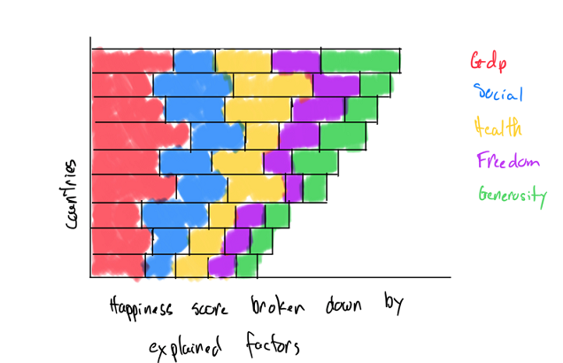

```{r setup, include=FALSE}
knitr::opts_chunk$set(echo = FALSE)
```

# Motivation

As countries get richer, we may assume that people become happier .Our Visualization aims to first show the trends of World Happiness from 2015 to 2020 for different countries, and its correlation with other factors such as Economic, Family, Freedom and Health etc.


# Objective

We aim to present this view with a series of charts including:

1.    Bar chart of the different factors
2.    Linear correlation chart between the Happiness index and other variables
3.    Heatmap of the variables
4.    Interactive World Happiness Map with animations for 2015~2020

# Data Visualization Approaches

We aim to present this view with a series of charts including:
We aim to present this view with a series of charts including:
We aim to present this view with a series of charts including:
We aim to present this view with a series of charts including:


# Prototypes of the Data Visualization

1.    Linear chart (Happiness Score vs. GDP Per Capita)


2.    Gantt Chart of Happiness Score across different regions/countries


3.    Happiness Score broken down by various factors


4.    dafddd


5.    Worldmap of Happiness


6.    dafddd


# Data Source

* Kaggle [Happiness Dataset](https://www.kaggle.com/unsdsn/world-happiness)
* World Happiness Report [Official Website](https://worldhappiness.report/)


## R Markdown

This is an R Markdown document. 


