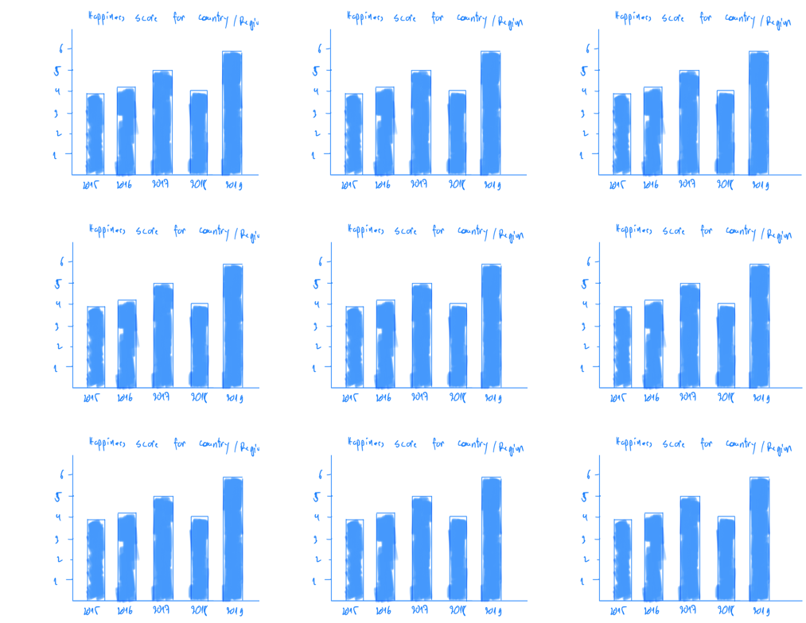
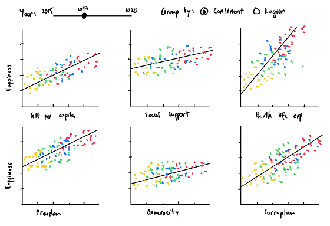

```{r setup, include=FALSE}
knitr::opts_chunk$set(echo = FALSE)
```

# 1. Motivation

<span style="color:navy">**Happiness**</span> leads to a wide range of benefits for our performance, health, relationships and more. So, rather than success being the key to <span style="color:navy">**Happiness**</span> , research shows that <span style="color:navy">**Happiness**</span>  could in fact be the key to success. Indeed, <span style="color:navy">**Happiness**</span>  also brings substantial benefits for society. <br>

The <span style="color:blue">_World Happiness Report_</span> is an annual survey by the Sustainable Development Solutions Network for the United Nations, revealing some countries are quite consistently outperforming in Happiness. The report measures 156 countries, ranking countries using the Gallup World Poll and six factors: levels of GDP, life expectancy, generosity, social support, freedom, and corruption income.<br>

In general, with the Government focus of generating wealth and economic growth, there is an assumption that leads 'naturally' to <span style="color:navy">**Happiness**</span> and improved quality of life for all residents. But is this true?
Specifically, by studying the relative achievements and correlations between countries and also over time, we can generate more insights of how <span style="color:navy">**Happiness**</span>  comes about. This information is important for individuals looking to emigrate, and for governments looking for good measure for actual 'quality of life' improvements.

# 2. Objective

Our project aims to show through a series of visualizations based on data analysis, to the audience regarding the actual factors influencing Happiness and also some comparisons between countries. 

By reviewing data and analyzing the trends of the <span style="color:blue">_World Happiness Report_</span> to uncover the key impacts and factors influencing the development of happiness, correlations between these factors for different countries  <span style="color:green">**from 2015 to 2020**</span>( last report was done in March 2020).


# 3. Data Visualization Approaches

We aim to present this view with a series of charts including:

1.  Exploratory Data Analysis such as Bar Chart and Gantt Chart etc.

2.	Co-occurrence and Linear Regression Analysis chart
*   For Various Constituent Variables

3.	Cluster Analysis of Happiness between countries for selected period, variables.

4.	Visualization of World Happiness Map
*   Interactive World Happiness Map with animations for 2015~2020

# 4. Prototypes of the Data Visualization

### 4.1    High-level layout of the Interactive Chart


### 4.2    Barchart of Happiness Score across different regions
A configurable bar charts allows the user to view the country-by-country trajectory of happiness score throughout the years. 




### 4.3    Stacked Barchart broken down by different variables
The World Happiness Report has broken down the happiness score into 6 explained factors, hence, using a stacked bar chart, users can analyze the composition of the happiness score and the weight/importance of each factor for each country/region.


### 4.4    Boxplot Chart of Happiness Score across different regions/countries

A horizontal boxplot chart will provide a different and broken down view of the distribution of happiness score and the measured factors among regions or continents.


### 4.5    Linear Regression Chart - Happiness against different variables
Multiple scatter plot with linear regression, each shows the happiness score compared to each measured factors: economic production, social support, life expectancy, freedom, perception of corruption, and generosity. The trends shown in the scatter plots will be a one-dimensional linear regression, fit independently for each factor



### 4.6    Clustering analysis
Cluster analysis is a technique for grouping similar observations into a number of clusters based on multiple variables for each individual observed values. Our proposed cluster analysis is to see that for the Happiness index, and also its constituent Happiness Variables, how close are the countries from the different continents. Another view we can form, is we cluster the countries based on certain or group of variables, are they another clear trends, and whether these trends change over time.


### 4.7    World Happiness Map
A choropleth world map to represent an aggregate summary of the happiness score and its' independent variables geographically. The map can give an overview of how each variable varies across each region and continent.


# 5. Data Source

* Kaggle [Happiness Dataset](https://www.kaggle.com/unsdsn/world-happiness)
* World Happiness Report [Official Website](https://worldhappiness.report/)


##### R Markdown

This is an R Markdown document. 


